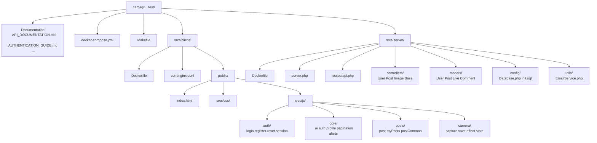
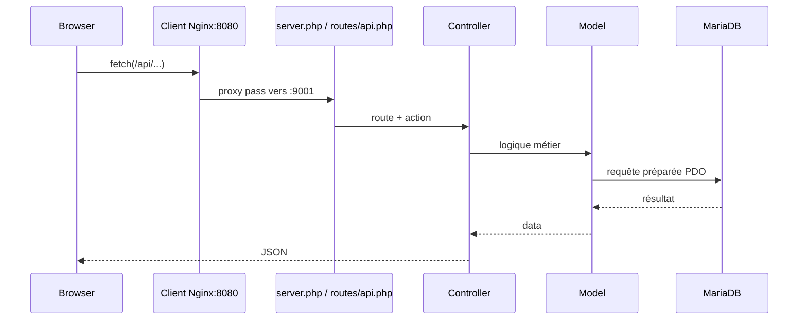

# Camagru — Schéma de structure du code

Ce document donne une vue rapide de l’architecture du projet pour onboarding, revue et soutenance.

## 1) Vue d’ensemble (containers + couches)

```mermaid
flowchart LR
  U[Utilisateur / Navigateur]

  subgraph Docker[Docker Compose]
    C[Client Nginx
    srcs/client]
    S[Serveur PHP
    srcs/server]
    D[(MariaDB)]
    M[MailHog]
  end

  U -->|HTTPS 8080| C
  C -->|/api/* proxy| S
  S -->|PDO| D
  S -->|mail() SMTP| M
```

## 2) Structure logique du repo



## 3) Flux d’une requête API



## 4) Découpage frontend (responsabilités)

- core: navigation, session, états globaux, profil, pagination.
- auth: login/register/verification/reset.
- posts: feed global, feed personnel, likes/commentaires/suppression.
- camera: webcam, upload, effet overlay, brouillons, sauvegarde.

## 5) Découpage backend (responsabilités)

- server.php: point d’entrée HTTP, session, dispatch API.
- routes/api.php: mapping URL -> contrôleur.
- controllers: validation, auth/CSRF, orchestration.
- models: accès SQL (PDO + prepared statements).
- config: connexion DB + schéma SQL.
- utils: services transverses (email).

## 6) Où commencer quand on lit le code

1. index.html pour voir les sections UI et scripts chargés.
2. srcs/js/core/ui.js pour la navigation entre vues.
3. routes/api.php pour la liste complète des endpoints.
4. controllers/\* pour la logique métier serveur.
5. models/\* pour les requêtes SQL.
6. docker-compose.yml pour le fonctionnement global.
