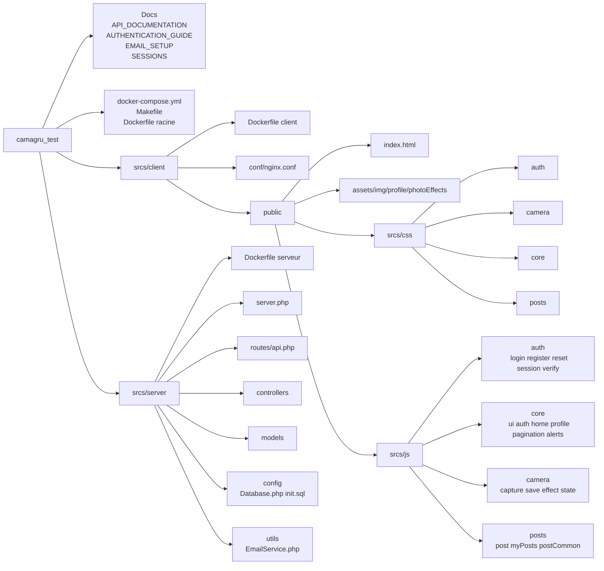
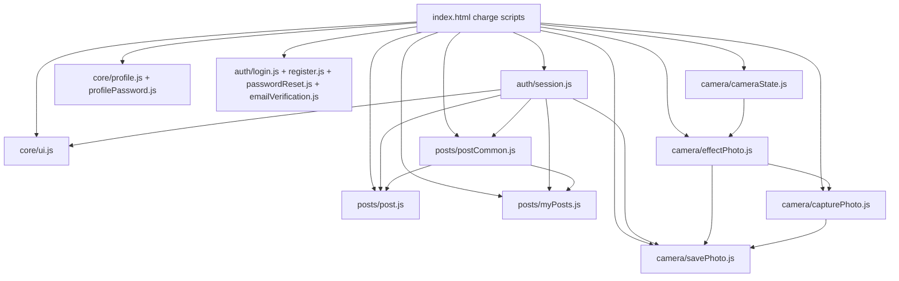
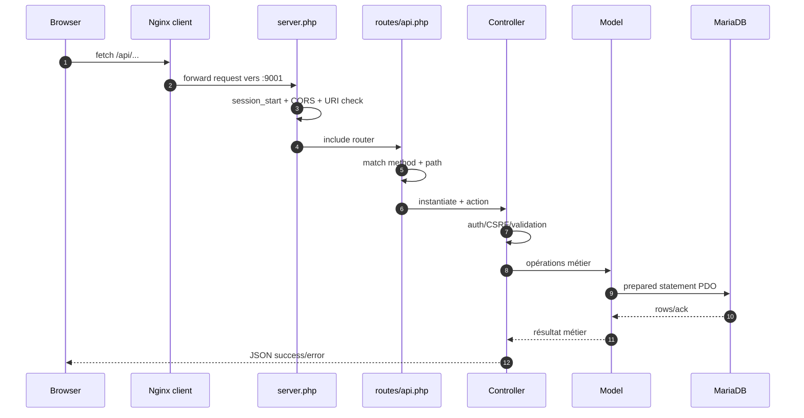
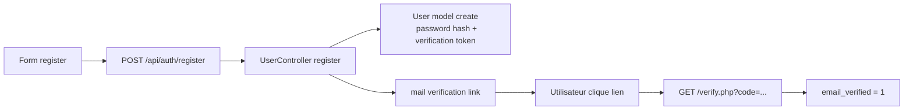
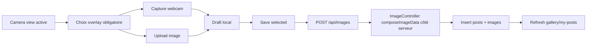
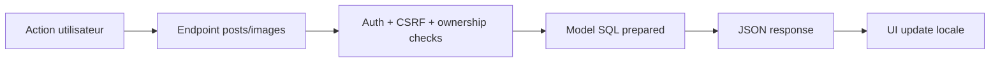

# Camagru — Schéma détaillé de structure du code

Ce document complète la version rapide et sert de référence technique pour comprendre le projet en profondeur.

## 1) Architecture complète (runtime)

```mermaid
flowchart TB
  User[Utilisateur
  Browser]

  subgraph ClientContainer[Container client]
    Nginx[Nginx TLS :8080]
    Static[HTML/CSS/JS statiques
    public/]
  end

  subgraph ServerContainer[Container serveur]
    PHP[PHP Built-in Server :9001
    server.php]
    Router[routes/api.php
    Router custom]
    Controllers[Controllers
    User/Post/Image/Base]
    Models[Models
    User/Post/Like/Comment]
    Utils[Email utils]
  end

  subgraph DBContainer[Container database]
    Maria[(MariaDB)]
    SQL[init.sql]
  end

  subgraph MailContainer[Container mail]
    Mailhog[MailHog SMTP+UI]
  end

  User -->|HTTPS| Nginx
  Nginx --> Static
  Nginx -->|Proxy /api/*| PHP
  PHP --> Router
  Router --> Controllers
  Controllers --> Models
  Models -->|PDO| Maria
  SQL --> Maria
  Controllers -->|mail() via SMTP| Mailhog
```

## 2) Carte détaillée des dossiers



## 3) Frontend — modules et dépendances



## 4) Backend — pipeline requête API



## 5) Routes API par domaine

```mermaid
graph TB
  API[/api/*/]

  API --> AUTH[Auth]
  AUTH --> L1[POST /api/auth/login]
  AUTH --> L2[POST /api/auth/register]
  AUTH --> L3[POST /api/auth/logout]
  AUTH --> L4[POST /api/auth/forgot-password]
  AUTH --> L5[POST /api/auth/reset-password]
  AUTH --> L6[GET /verify.php]
  AUTH --> L7[GET /reset-password.php]
  AUTH --> L8[GET /api/user/status]

  API --> USER[User]
  USER --> U1[PUT /api/user/profile]
  USER --> U2[POST /api/user/profile/password]
  USER --> U3[POST /api/user/avatar]
  USER --> U4[GET /api/avatar/*]

  API --> POSTS[Posts]
  POSTS --> P1[GET /api/posts]
  POSTS --> P2[POST /api/posts/*/like]
  POSTS --> P3[GET /api/posts/*/likes]
  POSTS --> P4[POST /api/posts/*/comment]
  POSTS --> P5[GET /api/posts/*/comments]
  POSTS --> P6[DELETE /api/posts/*/comments/*]

  API --> IMAGES[Images]
  IMAGES --> I1[POST /api/images]
  IMAGES --> I2[GET /api/images/user/*]
  IMAGES --> I3[DELETE /api/images/*]
```



## 6) Modèle de données (ER simplifié)

```mermaid
erDiagram
  USERS ||--o{ POSTS : creates
  USERS ||--o{ IMAGES : owns
  USERS ||--o{ LIKES : gives
  USERS ||--o{ COMMENTS : writes

  POSTS ||--o{ LIKES : receives
  POSTS ||--o{ COMMENTS : has
  POSTS ||--o| IMAGES : linked_post

  USERS {
    int id PK
    string username UNIQUE
    string email UNIQUE
    string password HASH
    bool email_verified
    string verification_token
    string reset_token
    datetime reset_token_expires
    bool notification_enabled
  }

  POSTS {
    int id PK
    int user_id FK
    string image_path
    text image_data
    text caption
    int likes_count
    datetime created_at
  }

  IMAGES {
    int id PK
    int user_id FK
    int post_id FK
    string image_path
    text image_data
    text caption
    datetime created_at
  }

  LIKES {
    int id PK
    int user_id FK
    int post_id FK
    datetime created_at
  }

  COMMENTS {
    int id PK
    int user_id FK
    int post_id FK
    text comment_text
    datetime created_at
  }
```

## 7) Flux fonctionnels clés

### 7.1 Inscription + vérification email



### 7.2 Capture/Upload + overlay + save



### 7.3 Like/Comment/Delete



## 8) Sécurité (où regarder rapidement)

- Hash mots de passe: srcs/server/models/User.php.
- Requêtes préparées PDO: srcs/server/models/\* + srcs/server/config/Database.php.
- Validation/sanitization: controllers User/Post/Image.
- Auth session + CSRF: BaseController + session.js.
- Ownership checks image/comment: ImageController + Comment model.
- CORS runtime: server.php + routes/api.php.

## 9) Ordre recommandé pour onboarding développeur

1. docker-compose.yml + Makefile.
2. srcs/client/public/index.html.
3. srcs/client/public/srcs/js/core/ui.js.
4. srcs/server/server.php puis srcs/server/routes/api.php.
5. controllers User/Post/Image.
6. models User/Post/Like/Comment.
7. config/init.sql.

## 10) Fichiers pivots

- Frontend navigation/session: srcs/client/public/srcs/js/core/ui.js, srcs/client/public/srcs/js/auth/session.js.
- Posts: srcs/client/public/srcs/js/posts/post.js, srcs/client/public/srcs/js/posts/myPosts.js, srcs/client/public/srcs/js/posts/postCommon.js.
- Camera: srcs/client/public/srcs/js/camera/capturePhoto.js, srcs/client/public/srcs/js/camera/savePhoto.js.
- Backend entry/routing: srcs/server/server.php, srcs/server/routes/api.php.
- Backend métier: srcs/server/controllers/UserController.php, srcs/server/controllers/PostController.php, srcs/server/controllers/ImageController.php.
- Data layer: srcs/server/models/\*.php, srcs/server/config/init.sql.
